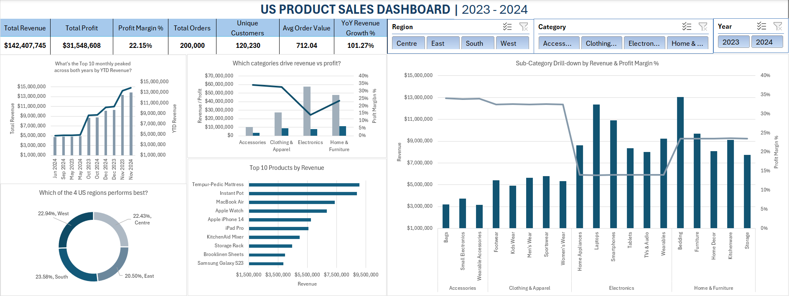

# 📊 US Product Sales Dashboard | 2023 – 2024



---

## 📌 Project Overview

This project analyses **200,000 US retail transactions** spanning January 2023 to December 2024 across four product categories, four regions, and 19 sub-categories. The goal was to build a fully interactive Excel dashboard that answers key business questions around revenue trends, regional performance, category profitability, and product rankings — simulating the kind of sales reporting an analyst would deliver to a commercial or operations team.

---

## 🎯 Business Questions Answered

- How did revenue and profit trend across 2023 vs 2024, and which months peaked?
- Which product categories drive the most revenue — and which have the best profit margin?
- Which of the 4 US regions generates the most revenue — and which is the most profitable by margin?
- What are the top 10 products by revenue, and how does profitability vary across sub-categories?

---

## 📈 Key Findings

1. **Revenue more than doubled year-over-year** — a YoY Revenue Growth of **101.27%** signals exceptionally strong sales momentum from 2023 into 2024, with November and December 2024 emerging as the highest-revenue months across both years.

2. **East leads in revenue but South leads in profitability** — the East region generated the highest revenue at $44,980,048.22, yet the South region recorded the highest Profit Margin % at 23.58%, highlighting that the highest-revenue region is not necessarily the most profitable — a critical distinction for regional budget and resource allocation decisions.

3. **Accessories is the most profitable category** — while Electronics likely generates competitive revenue, Accessories recorded the highest Profit Margin % across all four categories, making it the most capital-efficient product line.

4. **Tempur-Pedic Mattress is the single highest-revenue product** — topping the Top 10 Products chart ahead of the Instant Pot and MacBook Air, indicating that high-ticket Home & Furniture items punch above their weight in revenue contribution.

5. **Sub-category analysis reveals hidden margin variation** — within Electronics, Laptops and Smartphones dominate revenue but carry thinner margins compared to categories like Bags and Wearable Accessories within Accessories, reinforcing the need to analyse profitability at sub-category level, not just total revenue.

---

## 🗂️ Dataset

| Detail | Info |
|---|---|
| Source | [Kaggle — US Product Sales Dataset 2023–2024](https://www.kaggle.com/datasets/yashyennewar/product-sales-dataset-2023-2024) |
| Rows | 200,000 |
| Columns | 14 |
| Date Range | January 2023 – December 2024 |
| Geography | United States (4 Regions: Centre, East, South, West) |
| Categories | Accessories · Clothing & Apparel · Electronics · Home & Furniture |
| Sub-categories | 19 |
| Nulls | 0 |
| Duplicate Orders | 0 |

---

## 🧹 Data Quality & Preparation

**Power Query (M Language)**

The dataset imported with correct data types across all columns — no manual type conversion was required. Two data quality issues were identified and resolved:

- **Column name whitespace:** `Unit_Price`, `Revenue`, and `Profit` contained leading and trailing spaces in their column headers. These were trimmed before loading to prevent silent DAX formula failures.
- **Date dimension engineering:** Three calculated columns were added to support time intelligence on the dashboard:
  - `Year` — extracted using `Date.Year([Order_Date])`
  - `Month_Year` — formatted as "MMM YYYY" using `Date.ToText()`
  - `Quarter` — formatted as "Q1 2023" style using `Date.QuarterOfYear()` and `Date.Year()`

Data was loaded as a **connection only** into the **Power Pivot Data Model** to support DAX measures and handle 200,000 rows without sheet performance degradation.

---

## 🧮 DAX Measures (Power Pivot)

| Measure | Formula | Purpose |
|---|---|---|
| Total Revenue | `SUM([Revenue])` | Primary revenue KPI |
| Total Profit | `SUM([Profit])` | True profit — no estimation required |
| Total Orders | `DISTINCTCOUNT([Order_ID])` | Unique order count |
| Total Units Sold | `SUM([Quantity])` | Volume metric |
| Profit Margin % | `DIVIDE([Total Profit],[Total Revenue],0)` | Profitability efficiency |
| Avg Order Value | `DIVIDE([Total Revenue],[Total Orders],0)` | Revenue per order |
| Unique Customers | `DISTINCTCOUNT([Customer_Name])` | Customer reach |
| YoY Revenue Growth % | `DIVIDE(CurrentYear - PriorYear, PriorYear, 0)` using `DATEADD(...,-1,YEAR)` | Year-on-year growth |
| YTD Revenue | `TOTALYTD([Total Revenue], [Order_Date])` | Cumulative revenue, resets Jan 1 |

---

## 📊 Dashboard KPIs

| Metric | Value |
|---|---|
| Total Revenue | $142,407,745 |
| Total Profit | $31,548,608 |
| Profit Margin % | 22.15% |
| Total Orders | 200,000 |
| Unique Customers | 120,230 |
| Avg Order Value | $712.04 |
| YoY Revenue Growth % | 101.27% |

---

## 🗃️ Dashboard Components

| Chart | Type | Insight delivered |
|---|---|---|
| Monthly Revenue vs YTD | Combo (Column + Line) | Monthly peaks + cumulative trend across both years |
| Revenue & Profit by Category | Clustered Column + Margin Line | Revenue vs profitability trade-off per category |
| Profit Margin % by Region | Donut Chart | Profit margin comparison across 4 US regions |
| Top 10 Products by Revenue | Horizontal Bar | Highest-earning individual products |
| Sub-Category Drill-down | Clustered Column + Margin Line | Revenue and margin at sub-category level across all 4 categories |

**Interactive slicers:** Region · Category · Year · Quarter — all slicers are connected to all pivot tables via Report Connections, making every chart respond to a single filter click.

---

## 🛠️ Tools & Skills Used

- **Microsoft Excel** — dashboard layout, KPI cards, chart formatting
- **Power Query (M Language)** — data connection, column name cleaning, date dimension columns
- **Power Pivot** — data model, relationship management
- **DAX** — 9 measures including time intelligence (`TOTALYTD`, `DATEADD`) and `DISTINCTCOUNT`
- **Pivot Tables & Pivot Charts** — 6 pivot tables feeding 5 interactive charts
- **Slicers** — 4 slicers connected across all pivots via Report Connections

---

## 📁 Repository Structure

```
us-product-sales-dashboard-excel/
├── README.md
├── /data
│   └── product_sales_dataset_final.csv
├── /screenshots
│   └── US_Product_Sales_Full_Dashboard.png
└── /workbook
    └── US_Product_Sales_Dashboard.xlsx
```

---

## 🚀 How to Use

1. Clone this repository:
   ```bash
   git clone https://github.com/TheIbukunLawal/us-product-sales-dashboard-excel.git
   ```
2. Open `/workbook/US_Product_Sales_Dashboard.xlsx` in Microsoft Excel (Microsoft 365 or Office Professional Plus required for Power Pivot and DAX support)
3. If prompted to refresh data, click **Refresh All** under the Data tab
4. Use the **Region**, **Category**, **Year**, and **Quarter** slicers to filter the entire dashboard interactively

> **Note:** Power Pivot and DAX require Microsoft 365 or Office Professional Plus. The dashboard will not function correctly on Excel Home or Student editions.

---

## 👤 Author

**Lawal Ibukun**
[GitHub: @TheIbukunLawal](https://github.com/TheIbukunLawal)

*Data Analyst | Excel · SQL (learning) · Power BI (learning) | Open to global opportunities*
